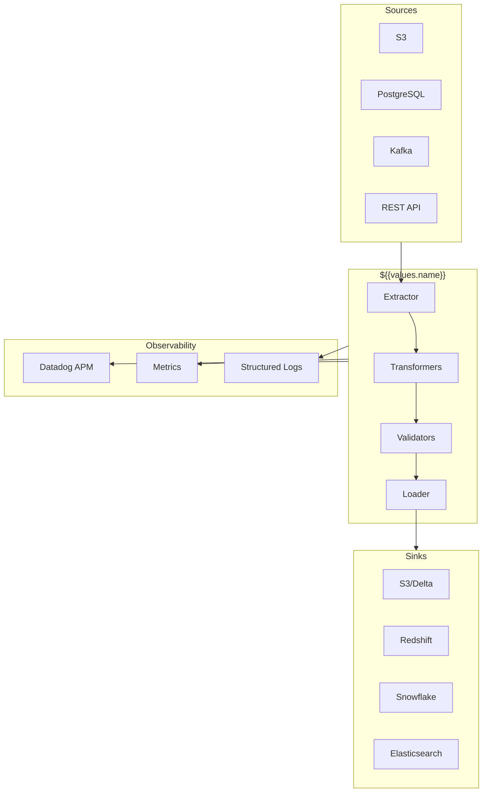
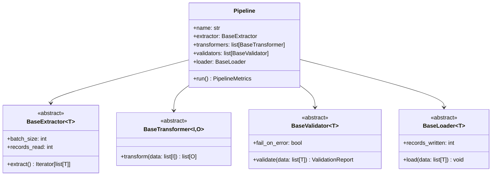
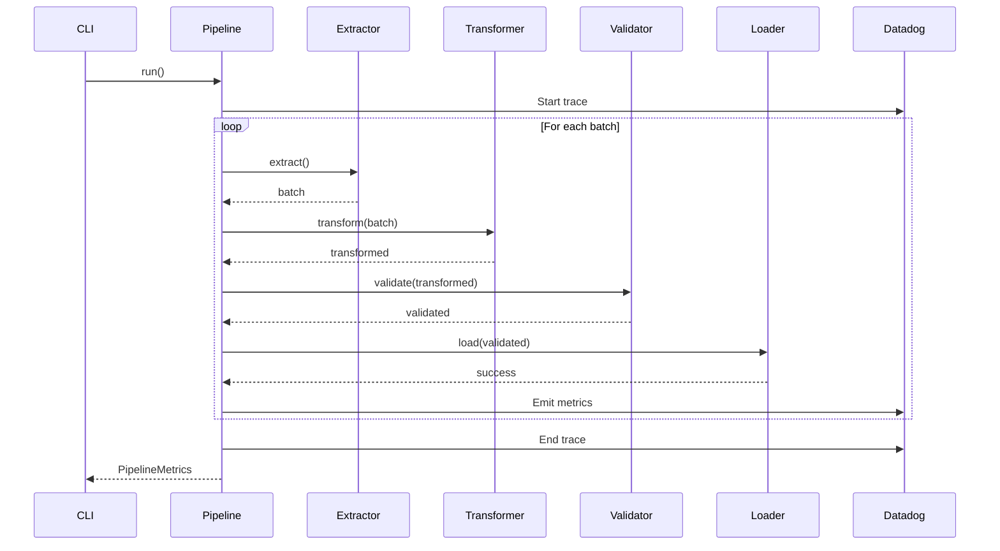
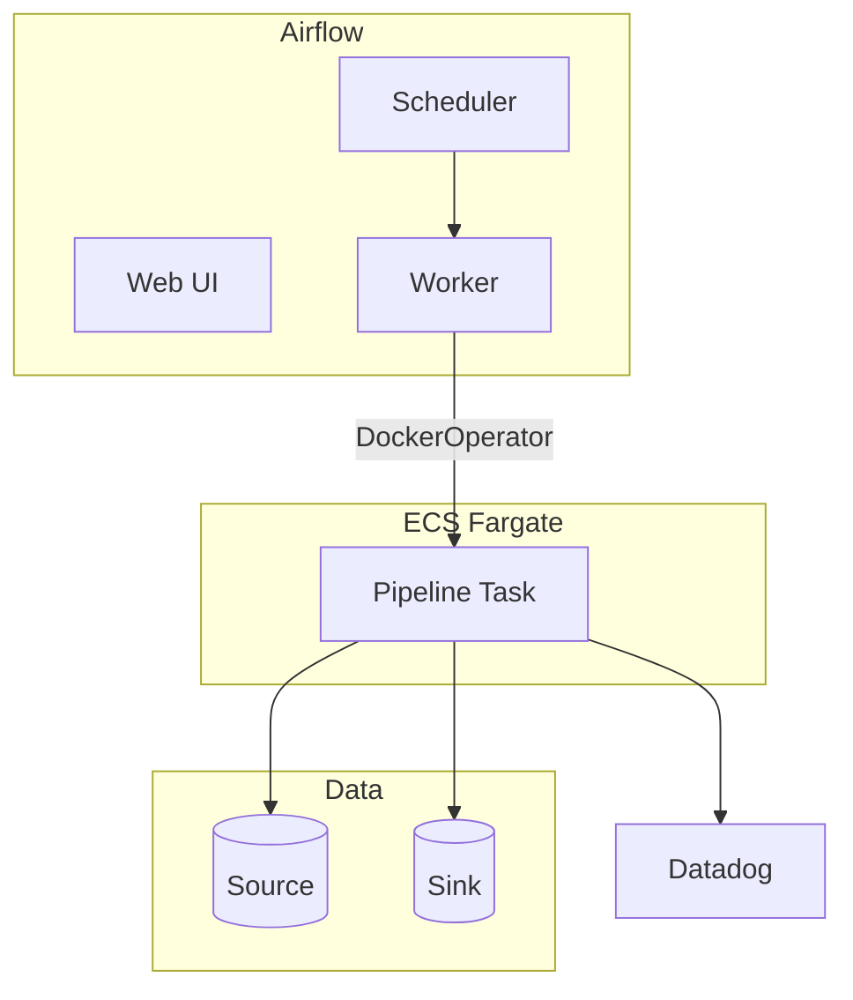
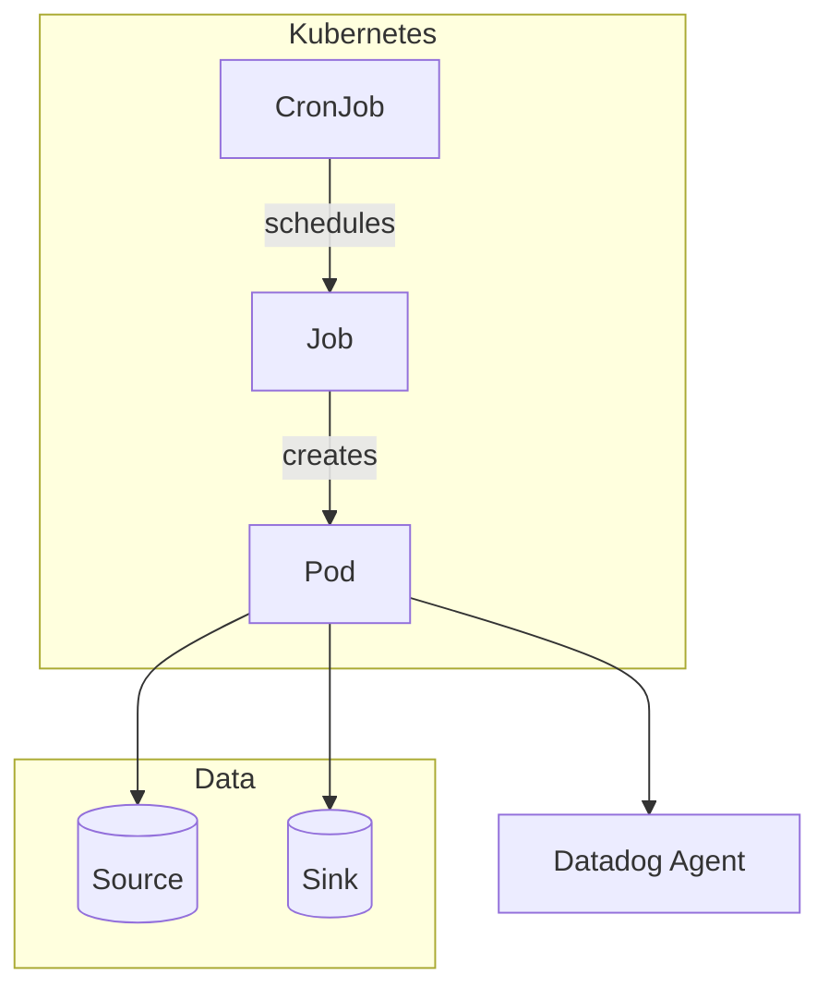
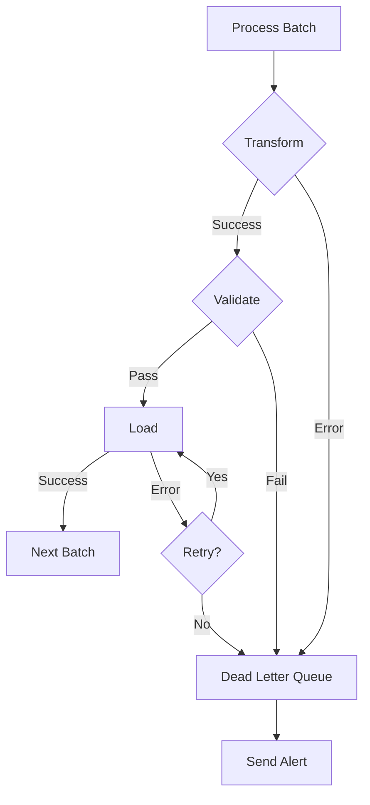
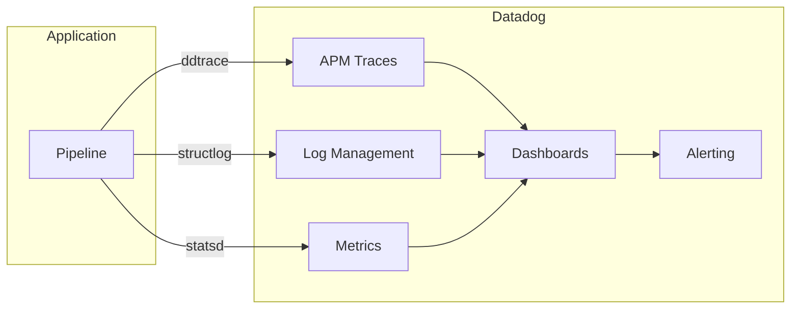

# Architecture

## System Overview

## Component Architecture

## Data Flow

## Deployment Architecture



### Airflow Deployment





### Kubernetes CronJob



## Error Handling

## Monitoring Stack

## Technology Stack

| Component | Technology |
|-----------|------------|
| Language | Python 3.12 |
| Package Manager | uv |
| Configuration | Pydantic Settings |
| Logging | structlog |
| Tracing | ddtrace |

| Data Processing | Polars |

| Data Processing | PySpark |

| Data Processing | Dask |

| Data Processing | Pandas |


| Data Quality | Great Expectations |

| Data Quality | Pandera |

| Data Quality | Soda |


| Orchestration | ${{values.orchestrator | title}} |

| Container Runtime | Docker |
| Orchestration | Kubernetes |
| CI/CD | GitHub Actions |
| Observability | Datadog |
